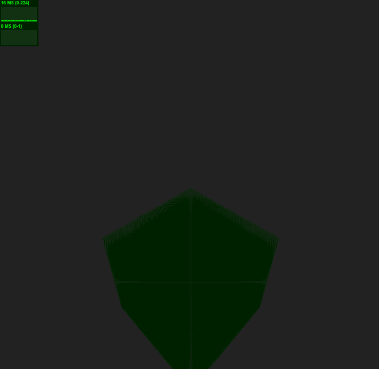

Progress Log
==============================

Particle Attribute Update via Texture
-------------------------------------
I've successfully packed my data as textures and have managed to read and modify it at least mostly correctly.

Currently I'm packing all particle data into a single texture, where one pixel is used for the position and one pixel is used for the velocity. MAC grid data is stored in two textures. One stores U, V, W velocities, and pressure. The other stores the old U, V, W velocities and grid cell type.

For particle attribute updates, most work so far is in the vertex shader. Applying gravity only involves rendering a quad the size of the velocity texture and appropriately decrementing the V velocity. I update particles by simply rendering an attribute array of consecutive numbers. These serve as indices into the particle texture. After doing somewhat tedious index calculations, I can extract the position and velocity for that particle. I can then lookup velocities in the grid textures to update the particle. Something I did not anticipate at first was that I need to have two particle buffers and ping-pong them because you cannot write to the same texture from which you are reading.

Here's an interesting blooper. I currently have no pressure solve so nothing prevents the particles from going out of bounds. If that happens, they do really weird things.
