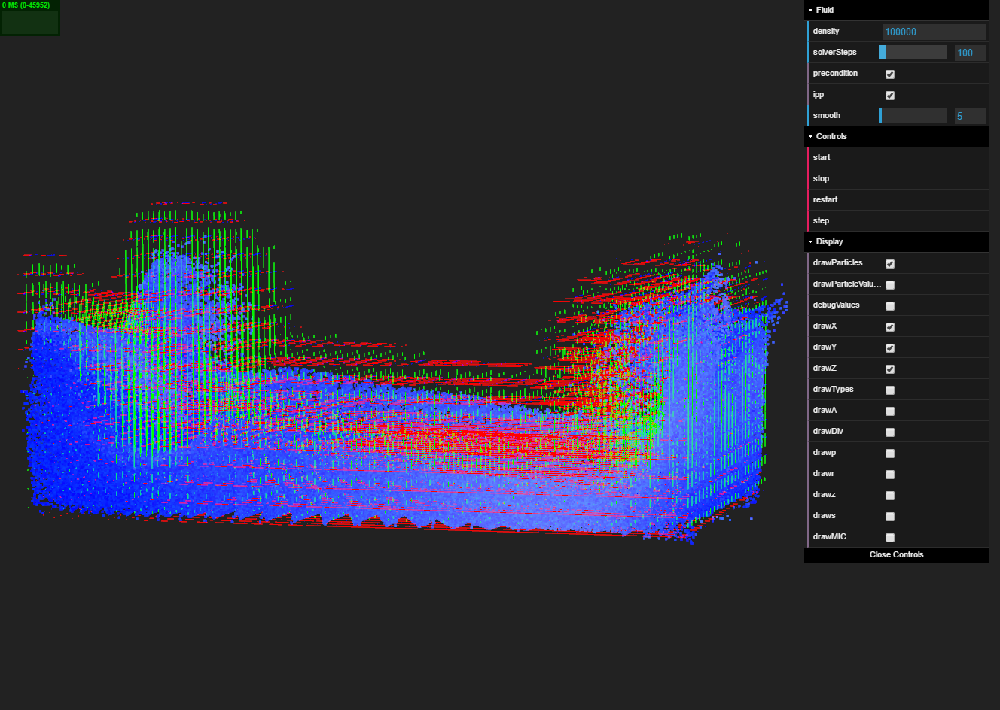
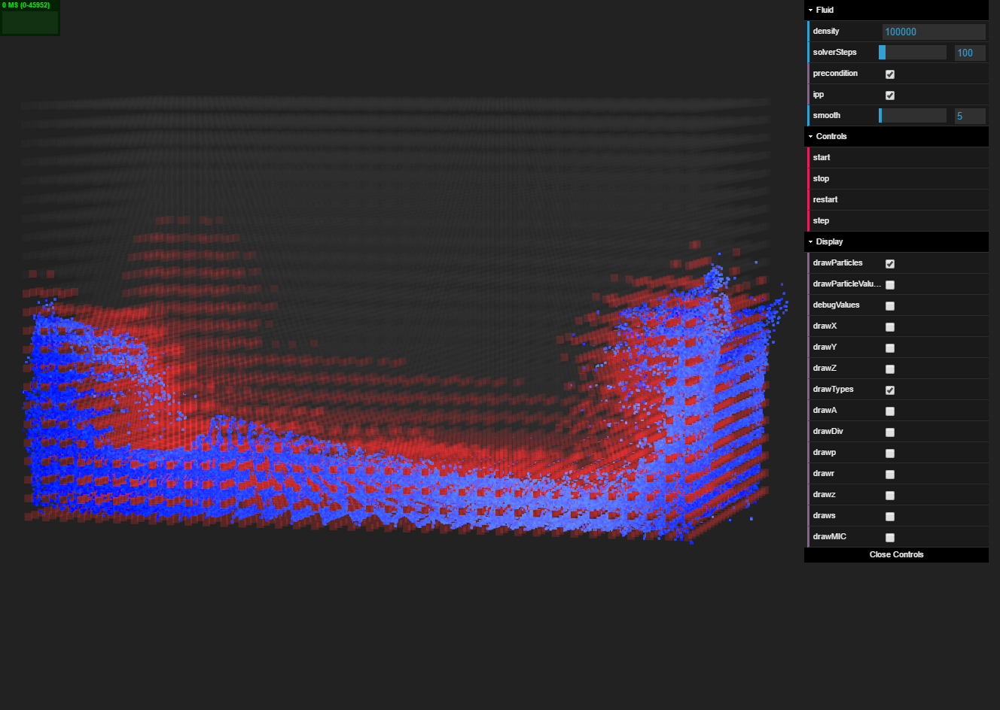
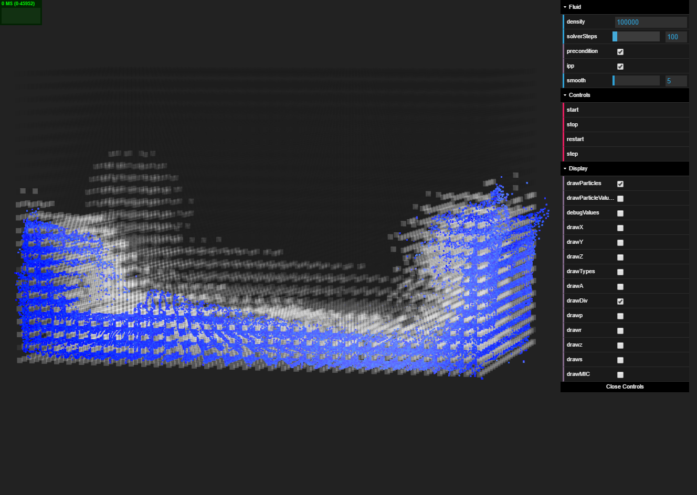
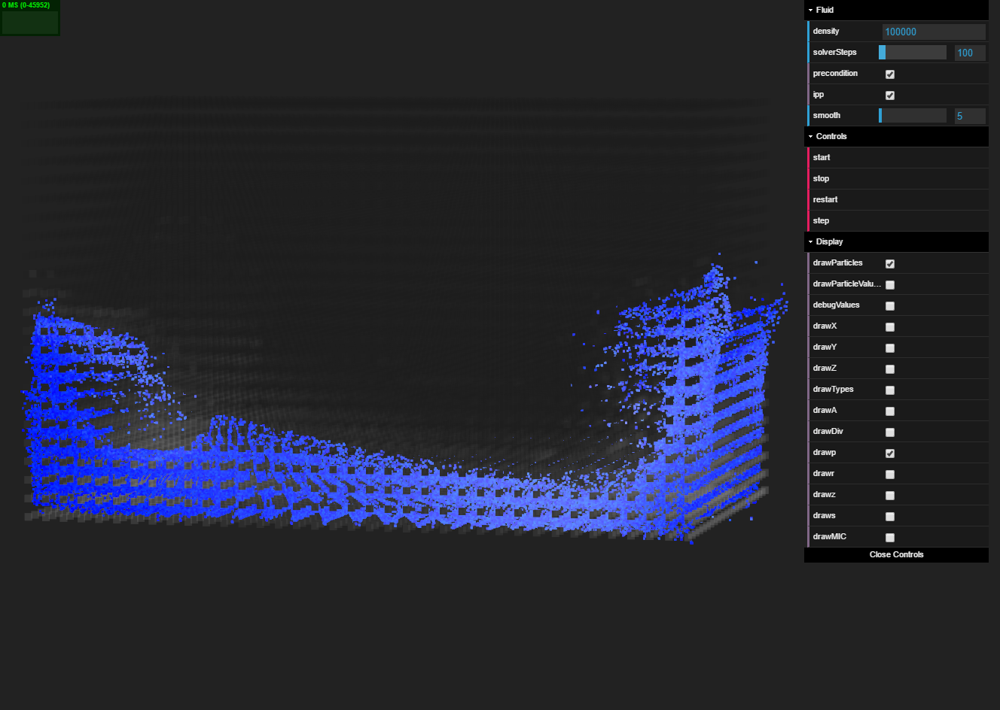
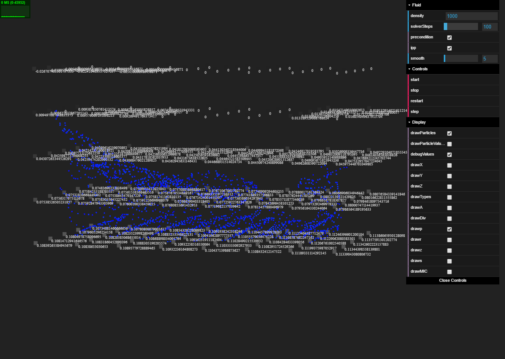

WebGL PIC/FLIP Fluid
=====================================
by [Austin Eng](http://austineng.github.io)

1. [Overview](#overview)
2. [Debug Views](#debug-views)
3. [Techniques](#techniques)
4. [Performance](#performance)
5. [Build & Running](#build)

## Overview

This project is a WebGL fluid simulation implementing of the PIC/FLIP method described in Zhu & Bridson's Siggraph 2005 paper [Animating Sand as a Fluid](https://www.cs.ubc.ca/~rbridson/docs/zhu-siggraph05-sandfluid.pdf). Bridson's book _Fluid Simulation for Computer Graphics_ was also an invaluable resource while working on this project. For a better understanding of these techniques, it is definitely advised to at least read those two resources.

## [Live Demo](http://austineng.github.io/WebGL-PIC-FLIP-Fluid/demo/)

## Debug Views

Debug view showing grid velocities

Debug view showing grid cell types

Debug view showing grid divergences

Debug view showing grid pressures

Debug view showing values of the pressure solve. All steps of the conjugate gradient solve are debuggable which was invaluable in checking the math.

## Techniques

As the name implies, PIC/FLIP is a hybrid method which mixes the perspectives of solving the system from a particle point of view (Lagrangian) and solving the system from a grid point of view (Eulerian). One of the motivations behind this is that it is much easier to solve for forces such as pressure on a uniform grid, but it makes more sense to keep track of specific particle attributes such as position and velocity on the particles themselves. Thus, for every frame, we project our particle attributes onto the grid, compute forces and presssure on the grid, and then interpolate updated velocities back onto the particles before advection. The PIC/FLIP part comes in how we update with new velocities. With the PIC approach, we simply update particles with the new grid velocity. With the FLIP approach, we increment the particle velocity by the delta in grid velocity. The latter better maintains individual particle velocities but can become chaotic, so it is common to use a blend of 5% PIC and 95% FLIP.

The following will be an abbreviated breakdown of how all of the steps in the fluid solve are accomplished in shaders.

### Particle-to-Grid

This first step is a fairly tricky and annoying part of the solve. For every particle, we need to project it's velocity to possibly 3x27 = 81 different locations. There are three grids to project onto (U, V, W for X, Y, Z velocities) but we need to project onto the 27 cells in our direct neighborhood. To do this, we do exactly that. For every particle, we render 81 gl.POINTS. In practice, this is calling `gl.drawArrays(pointBuffer, 0, 81*pointCount)`.

We number these points with increasing values so that in the vertex shader we can correctly compute which grid we are to project onto. After calculating the correct grid and grid location, we compute the UV coordinate of that position and set glPosition accordingly.

Note that we want each grid cell to store the weighted average of all the nearby particles so we actually need to accumulate all of the nearby velocities and keep track of their weights. To do this, we preface our draw call with `gl.enable(gl.BLEND)` and `gl.blendFunc(gl.ONE, gl.ONE)`. This will allow us to take advantage of hardware blending functions to accumulate influences. In practice, we do this draw call twice, writing to different framebuffers. To one we write velocity * weight, and to the other we write just the weight. Finally, we bind both textures and render a texture-sized quad, dividing all accumulated velocities by their respective cumulative weight.

### Copy-Grid

At this point, we copy our velocity field to a new texture. This is important for later computing the change in grid velocity.

### Mark-Cells

In this step we mark cells with the type of their contents: either SOLID, FLUID, or AIR. Marking cells is important because we use this information later to set up our pressure equations. To accomplish this, we do a similar scatter-approach taken in the particle-to-grid transfer. All cells are originally air (value is 0). We then render 7 points for each particle. We use 7 because we actually want to mark the cells at the fluid boundary as fluid as well, we we extend the fluid-marking in each cardinal direction. Using the point index, we compute the grid cell we want to project onto and write a value of 1.0 (FLUID) to the computed UV coordinate. If there are solids in the scene, we do the same thing for them. Note: we __do not__ use `gl.blend(gl.ONE, gl.ONE)`. We do not want to accumulate the values of cell types.

### Gravity-Update

This is a fairly simple step where we just render a fullscreen quad and increment the y-velocities by G * timestep. In practice, I only update velocities near non-air cells or the debug views become difficult to view.

### Pressure-solve

This is the most computational intensive part of the fluid solve. This is fairly complicated (it is definitely advised to read Bridson's book), but in short, we want to solve a pressure equation that will result in 0 divergence within the fluid. In other words, we want to compute pressures that will cause the fluid to move in such a way that it does not lose or gain any volume. 

This comes down to solving a system `Ap = b`, where `b` is a vector of divergences (total change in velocity across a cell), and `A` is a coefficient matrix. If we have an `X x Y x Z` grid, the dimensions of `A` are `X*Y*Z x X*Y*Z`. If you work through the pressure equations, we realize that the diagonal entries of A denote the number of non-solid neighbors that cell `(i, j, k)` has, and the entries of the form `<(i1, j1, k1), (i2, j2, k2)>` are `-1` if those two cells are both fluid and `0` otherwise. Fortunately, this means that `A` is a very, very sparse matrix because each cell has at most 6 neighbors. Every row and column in `A` has __at most__ 7 entries. Furthermore, A is symmetric so half of the non-diagonal entries don't need to be stored. This ultimately comes down to just 4 entries per cell, which is easily stored in the RGBA components of a single texture!

The system is solved using the [preconditioned conjugate gradient method](https://en.wikipedia.org/wiki/Conjugate_gradient_method#The_preconditioned_conjugate_gradient_method) which is an iterative method for solving systems like this (symmetric, positive-definite). The details are better explained elsewhere but I will briefly explain how some of the important steps are accomplished.

__Preconditioning__

Preconditioning is an extremely important step of the solve which makes it signficiantly faster to solve. `A` is typically not an invertible matrix, but preconditioning constructs an approximate inverse of `A` which enables us to get much closer to the correct solution in less time. Typically, CPU solvers use an Incomplete Cholesky preconditioner which works very, very well. However, it is not well suited to a GPU or shader implementation because it requires doing two triangular matrix solves with forward and backsubstitution for every iteration. On a GPU this is absolutely terrible and would involve hundreds of serial kernel invocations or draw calls. Instead, we use the Incomplete Poisson preconditioner which is accomplished with just two draw calls.

Given a residual vector `r`, we want compute `z = Mr`, where `M` is an approximate inverse of `A`. The Incomplete Poisson preconditioner says that M = (I - LD-1)(I - D-1L) where `L` i strictly the lower diagonal entries of `A` and `D` is strictly the diagonal entires of `A`. We just need to compute z = (I - LD-1)(I - D-1L)r which is just two draw calls, one for each matrix multiply.

For each entry in `r`:

  1.  Set `z[i] = r[i] - r * L[i, :] * 1/d`. This is easy because `L` is sparse and has just 3 items in row i. `d` is just the diagonal entry corresponding to *row* i.
  2. Set `z[i] = z[i] - z * L[i, :] * 1/d`. This is easy because `L` is sparse and has just 3 items in row i. `d` is just the diagonal entry corresponding to *column* i.

__Dot Products__

Unfortunately, we need to take three dot products every iteration, which is not a very parallel operation. We once again take advantage of texture blending and using `gl.blend(gl.ONE, gl.ONE)` and write all products to the same UV coordinate to accumulate them.

### Velocity Extrapolation

In this step we extrapolate velocities to push the velocities one grid cell past the fluid cells. This is important so that particles don't lose energy when they come in contact with air cells. This is implemented in a fragment shader as a gather operation which does a few grid type checks in the cardinal directions and appropriately updates velocity.

### Grid-To-Particle

The grid-to-particle transfer is much simpler than the particle-to-grid transfer. For this, we only need to compute our fractional grid cell index and then trilinear-ly interpolate our new updated velocity.

## Performance

**Tested on: Windows 10, i7-4770K @ 3.50GHz 16GB, GTX 780 3072MB**

| Grid Density   | FPS (Incomplete Cholesky) | FPS (Incomplete Poisson) |
|----------------|---------------------------|--------------------------|
| 5,000          | 40                        | 60                       |
| 10,000         | 30                        | 60                       |
| 50,000         | 9                         | 33                       |
| 100,000        | 3                         | 17                       |
| 500,000        | 0.5                       | 6                        |
| 1,000,000      | 0.2                       | 3                        |

As we can see, using the Incomplete Poisson preconditioner has signficant performance benefits and is able to more effectively handle high grid resolutions.

Keeping grid density constant but doubling particle density, these numbers are exactly the same, confirming that the limiting factor for performance is the pressure solve, which is bound by grid density.

## Build

1. [Install `Node.js`](https://nodejs.org/en/download/)
2. Fork and clone this repository.
3. `npm install` in the project root directory.
4. `npm run build` and open `demo/index.html` OR `npm start` and navigate to `localhost:3000/demo`